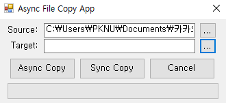

# StudyCsharp
PKNU C# 학습 리포지토리

-------------------------------------

## 📘 C# - Console

0. Hello World
1. 데이터 형식 및 지정
2. 연산자
3. 조건 / 반복 / 점프
4. 메소드
5. 클래스와 인스턴스 + 상속
6. 인터페이스 와 추상 클래스
7. 배열과 Index
8. 일반화 클래스
9. 예외 처리
10. 이벤트와 대리자
11. 람다식 & LINQ
12. File 다루기
13. Thread

[C# Console 상세](https://github.com/kg4543/StudyCsharp21/blob/main/Console/README.md)  
[C# console 소스 모음](https://github.com/kg4543/StudyCsharp21/tree/main/Console)

-------------------------------------
## 📗 Practice - (Console)주소록

<kbd></kbd>

[Practice 상세](/chap99_주소록/Chap99/README.md)  
[Practice 소스 모음](/chap99_주소록/Chap99/Chap99)

-------------------------------------
## 📕 C# - Winform

<kbd></kbd>  
<kbd></kbd>

[C# Winform 상세](/Winform/README.md)  
[C# Winform 추가](https://github.com/kg4543/StudyDesktopApp)  
